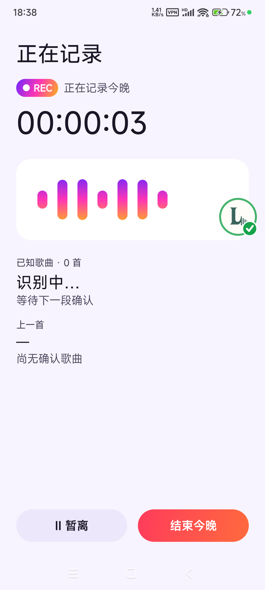

# NightRec

> Tap "Start tonight" once at a bar or club, then lock your phone or use other apps freely — NightRec keeps recording the whole night's DJ set and marks where each track and transition happened.

[简体中文](./README.md) | English



## What is this?

NightRec is an Android app (package `com.nightrec.app`) for people who want to keep the full sound of a continuous music setting — a bar, a club, or a live set.

It does not produce a scattered list of songs. Instead it gives you **one seamless, scrubbable track of the whole night**, then overlays **track / transition markers** on top of it. So what you replay is the real night, not platform originals cut into pieces.

The design is "keep the original first, process later": once the live original is captured it is never modified, and AI cleanup only produces a separate derived version, always falling back to the original when confidence is low.

## Key features

- **One-tap start, continuous all night** — locking the screen or switching to another ordinary app does not interrupt recording; a persistent system recording notification is shown.
- **Step away without breaking the night** — tapping "Away" seals the current segment and stops the mic; tapping "I'm back" resumes the same session and leaves a real time gap on the timeline.
- **Continuous recognition with a stable timeline** — recognizes songs while recording (AudD), de-duplicates repeats and avoids jumping on a single A+B mix hit; unrecognized ranges are kept and can be re-recognized later.
- **Replay right after you stop** — the live original is playable immediately; multiple physical segments appear as a single progress bar, track markers jump to the live position, and away-gaps are skipped by default.
- **AI cleanup (conservative Beta)** — switch between "Live original / AI cleaned" to reduce nearby speech while keeping the lead vocal and DJ transitions.
- **Protects the night through failures** — mic loss, offline, process restart, or low storage prioritize keeping what was already recorded and support recovery, without falsely ending the night.

## Quick start

Requirements: JDK 17, Android SDK (compile/target 36), a device or emulator with minSdk 29+.

```bash
# 1) Point to your Android SDK / JDK
#    set sdk.dir in local.properties, or use ANDROID_HOME / JAVA_HOME

# 2) Build the debug APK
./gradlew assembleDebug
# output: app/build/outputs/apk/debug/app-debug.apk

# 3) Install on a connected device
./gradlew installDebug
#   or: adb install -r -t app/build/outputs/apk/debug/app-debug.apk
```

After launch, grant the microphone permission and tap "Start tonight" on the home screen.

## Installation

### Requirements

- JDK 17
- Android SDK: `compileSdk = 36`, `targetSdk = 36`, `minSdk = 29`
- Android Gradle Plugin 9.4.0 / Gradle 9.6 (bundled via the repo's `gradlew`)

### Install

```bash
git clone https://github.com/wanghoufan/p041-nightrec.git
cd p041-nightrec
./gradlew installDebug
```

## Usage

1. First launch: confirm the privacy notice and grant microphone permission (recording cannot start without it, and a fix entry point is shown).
2. Tap "Start tonight" on the home screen; name, location, AI cleanup, and live recognition are all optional.
3. Put the phone down, lock it, or use other apps — as long as you don't tap "Away", the session keeps running.
4. When you leave, tap "Away"; when you return, tap "I'm back" and it continues the same night.
5. To finish, tap "End tonight" and confirm; you can then replay immediately.
6. In the player, scrub the whole-night bar, tap a track marker to jump to the live moment, or switch between "Live original / AI cleaned".

## Configuration

Using the app only needs on-device permissions. **Recognition is optional**; for real recognition:

In `local.properties` (already `.gitignore`d, never committed):

| Key | Description |
| --- | --- |
| `AUDD_API_TOKEN` | AudD recognition API token (for local debugging) |
| `AUDD_REQUEST_LIMIT` | Local request budget cap, default `300` |

> The token is only compiled into `BuildConfig` for debug builds; release builds are empty. Never commit a real token.

## Documentation

- Product spec and tasks: [spec.md](./specs/001-night-session/spec.md), [plan.md](./specs/001-night-session/plan.md), [tasks.md](./specs/001-night-session/tasks.md)
- Technical decisions: [docs/decisions/](./docs/decisions/)
- Verification and device evidence: [docs/verification/](./docs/verification/)
- Android build conventions: [docs/sop/android.md](./docs/sop/android.md)
- Development handoff: [docs/handoff/HANDOFF.md](./docs/handoff/HANDOFF.md)

## Known limitations

- **Cleanup is a conservative Beta** — it only reduces nearby speech and **does not guarantee lossless removal**; no full-night Remove Vocals, and it always falls back to the live original when confidence is low.
- **Recognition depends on AudD and a shared budget** — requests are capped; once exhausted, only network recognition (including backfill / manual re-recognition) pauses, while capture and playback continue. No automatic payment.
- **Recognition needs real loudspeaker audio** — with wired earphones the microphone physically cannot pick up the sound, so recognition cannot be verified.
- **Currently a debug build** — no release signing or obfuscation yet; intended for local verification.
- **No separate license** — the repository ships without an open-source license.

## License

No license provided (private repository).